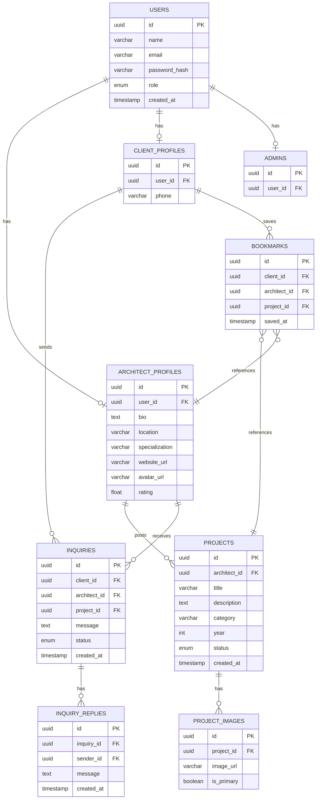

# ER Diagram

```mermaid
erDiagram

    USERS {
        uuid id PK
        varchar name
        varchar email
        varchar password_hash
        enum role
        timestamp created_at
    }

    ARCHITECT_PROFILES {
        uuid id PK
        uuid user_id FK
        text bio
        varchar location
        varchar specialization
        varchar website_url
        varchar avatar_url
        float rating
    }

    CLIENT_PROFILES {
        uuid id PK
        uuid user_id FK
        varchar phone
    }

    PROJECTS {
        uuid id PK
        uuid architect_id FK
        varchar title
        text description
        varchar category
        int year
        enum status
        timestamp created_at
    }

    PROJECT_IMAGES {
        uuid id PK
        uuid project_id FK
        varchar image_url
        boolean is_primary
    }

    INQUIRIES {
        uuid id PK
        uuid client_id FK
        uuid architect_id FK
        uuid project_id FK
        text message
        enum status
        timestamp created_at
    }

    INQUIRY_REPLIES {
        uuid id PK
        uuid inquiry_id FK
        uuid sender_id FK
        text message
        timestamp created_at
    }

    BOOKMARKS {
        uuid id PK
        uuid client_id FK
        uuid architect_id FK
        uuid project_id FK
        timestamp saved_at
    }

    ADMINS {
        uuid id PK
        uuid user_id FK
    }

    %% Relationships
    USERS ||--o| ARCHITECT_PROFILES : "has"
    USERS ||--o| CLIENT_PROFILES : "has"
    USERS ||--o| ADMINS : "has"

    ARCHITECT_PROFILES ||--o{ PROJECTS : "posts"
    PROJECTS ||--o{ PROJECT_IMAGES : "has"

    CLIENT_PROFILES ||--o{ INQUIRIES : "sends"
    ARCHITECT_PROFILES ||--o{ INQUIRIES : "receives"
    INQUIRIES ||--o{ INQUIRY_REPLIES : "has"

    CLIENT_PROFILES ||--o{ BOOKMARKS : "saves"
    BOOKMARKS }o--|| PROJECTS : "references"
    BOOKMARKS }o--|| ARCHITECT_PROFILES : "references"
```
