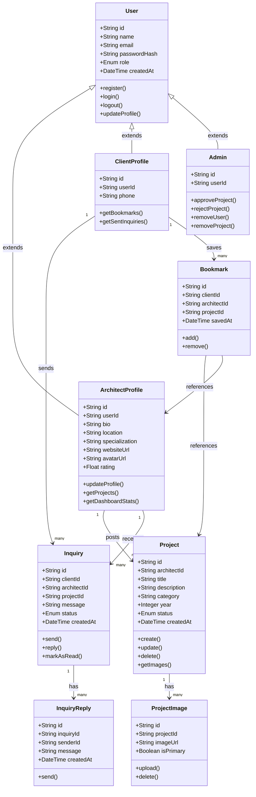

# Class Diagram

```mermaid
classDiagram
    class User {
        +String id
        +String name
        +String email
        +String passwordHash
        +Enum role
        +DateTime createdAt
        +register()
        +login()
        +logout()
        +updateProfile()
    }

    class ArchitectProfile {
        +String id
        +String userId
        +String bio
        +String location
        +String specialization
        +String websiteUrl
        +String avatarUrl
        +Float rating
        +updateProfile()
        +getProjects()
        +getDashboardStats()
    }

    class ClientProfile {
        +String id
        +String userId
        +String phone
        +getBookmarks()
        +getSentInquiries()
    }

    class Project {
        +String id
        +String architectId
        +String title
        +String description
        +String category
        +Integer year
        +Enum status
        +DateTime createdAt
        +create()
        +update()
        +delete()
        +getImages()
    }

    class ProjectImage {
        +String id
        +String projectId
        +String imageUrl
        +Boolean isPrimary
        +upload()
        +delete()
    }

    class Inquiry {
        +String id
        +String clientId
        +String architectId
        +String projectId
        +String message
        +Enum status
        +DateTime createdAt
        +send()
        +reply()
        +markAsRead()
    }

    class InquiryReply {
        +String id
        +String inquiryId
        +String senderId
        +String message
        +DateTime createdAt
        +send()
    }

    class Bookmark {
        +String id
        +String clientId
        +String architectId
        +String projectId
        +DateTime savedAt
        +add()
        +remove()
    }

    class Admin {
        +String id
        +String userId
        +approveProject()
        +rejectProject()
        +removeUser()
        +removeProject()
    }

    %% Relationships
    User <|-- ArchitectProfile : extends
    User <|-- ClientProfile : extends
    User <|-- Admin : extends

    ArchitectProfile "1" --> "many" Project : posts
    Project "1" --> "many" ProjectImage : has

    ClientProfile "1" --> "many" Inquiry : sends
    ArchitectProfile "1" --> "many" Inquiry : receives
    Inquiry "1" --> "many" InquiryReply : has

    ClientProfile "1" --> "many" Bookmark : saves
    Bookmark --> Project : references
    Bookmark --> ArchitectProfile : references
```
