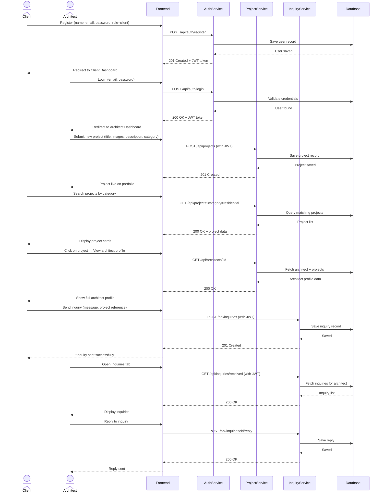

# Sequence Diagram

## Main Flow: Client discovers an architect and sends an inquiry

```mermaid
sequenceDiagram
    actor Client
    actor Architect
    participant Frontend
    participant AuthService
    participant ProjectService
    participant InquiryService
    participant Database

    %% --- Client Registration & Login ---
    Client->>Frontend: Register (name, email, password, role=client)
    Frontend->>AuthService: POST /api/auth/register
    AuthService->>Database: Save user record
    Database-->>AuthService: User saved
    AuthService-->>Frontend: 201 Created + JWT token
    Frontend-->>Client: Redirect to Client Dashboard

    %% --- Architect posts a project ---
    Architect->>Frontend: Login (email, password)
    Frontend->>AuthService: POST /api/auth/login
    AuthService->>Database: Validate credentials
    Database-->>AuthService: User found
    AuthService-->>Frontend: 200 OK + JWT token
    Frontend-->>Architect: Redirect to Architect Dashboard

    Architect->>Frontend: Submit new project (title, images, description, category)
    Frontend->>ProjectService: POST /api/projects (with JWT)
    ProjectService->>Database: Save project record
    Database-->>ProjectService: Project saved
    ProjectService-->>Frontend: 201 Created
    Frontend-->>Architect: Project live on portfolio

    %% --- Client browses and contacts architect ---
    Client->>Frontend: Search projects by category
    Frontend->>ProjectService: GET /api/projects?category=residential
    ProjectService->>Database: Query matching projects
    Database-->>ProjectService: Project list
    ProjectService-->>Frontend: 200 OK + project data
    Frontend-->>Client: Display project cards

    Client->>Frontend: Click on project → View architect profile
    Frontend->>ProjectService: GET /api/architects/:id
    ProjectService->>Database: Fetch architect + projects
    Database-->>ProjectService: Architect profile data
    ProjectService-->>Frontend: 200 OK
    Frontend-->>Client: Show full architect profile

    Client->>Frontend: Send inquiry (message, project reference)
    Frontend->>InquiryService: POST /api/inquiries (with JWT)
    InquiryService->>Database: Save inquiry record
    Database-->>InquiryService: Saved
    InquiryService-->>Frontend: 201 Created
    Frontend-->>Client: "Inquiry sent successfully"

    %% --- Architect views and replies ---
    Architect->>Frontend: Open Inquiries tab
    Frontend->>InquiryService: GET /api/inquiries/received (with JWT)
    InquiryService->>Database: Fetch inquiries for architect
    Database-->>InquiryService: Inquiry list
    InquiryService-->>Frontend: 200 OK
    Frontend-->>Architect: Display inquiries

    Architect->>Frontend: Reply to inquiry
    Frontend->>InquiryService: POST /api/inquiries/:id/reply
    InquiryService->>Database: Save reply
    Database-->>InquiryService: Saved
    InquiryService-->>Frontend: 200 OK
    Frontend-->>Architect: Reply sent
```
