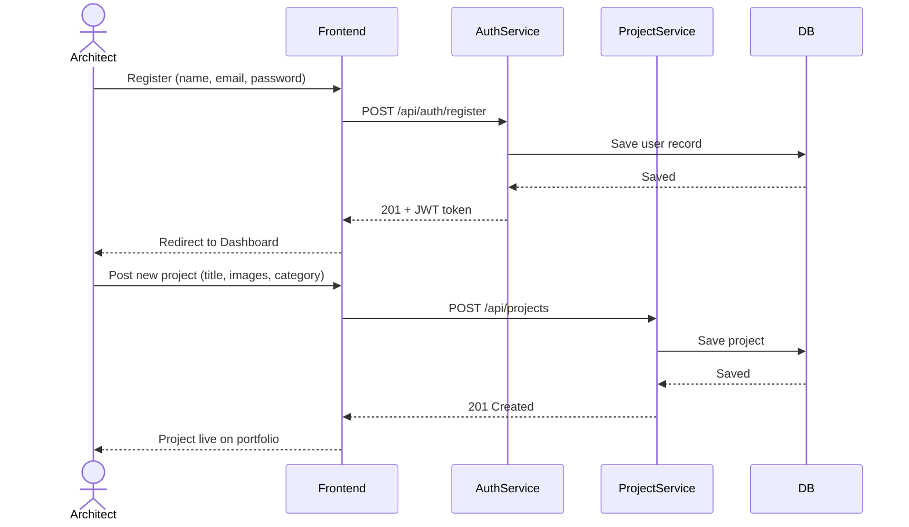
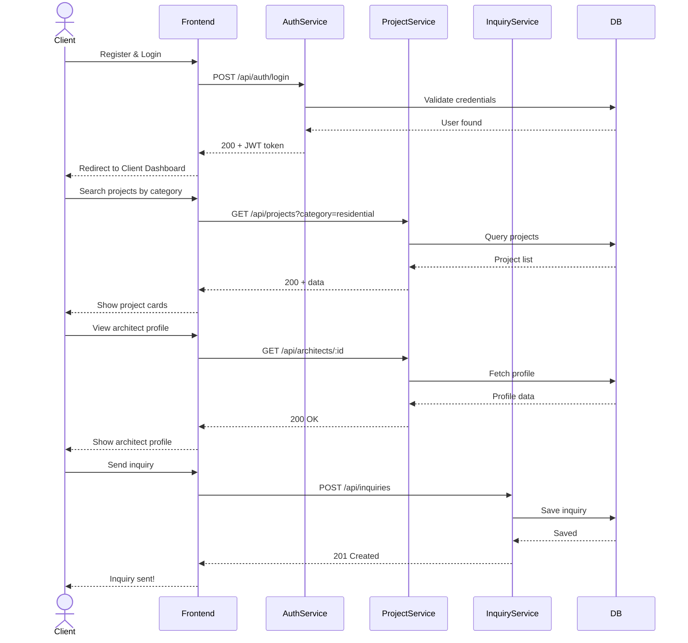

# Sequence Diagram

## Flow 1: Architect Registration & Project Posting

```mermaid
sequenceDiagram
    actor Architect
    participant Frontend
    participant AuthService
    participant ProjectService
    participant DB

    Architect->>Frontend: Register (name, email, password)
    Frontend->>AuthService: POST /api/auth/register
    AuthService->>DB: Save user record
    DB-->>AuthService: Saved
    AuthService-->>Frontend: 201 + JWT token
    Frontend-->>Architect: Redirect to Dashboard

    Architect->>Frontend: Post new project (title, images, category)
    Frontend->>ProjectService: POST /api/projects
    ProjectService->>DB: Save project
    DB-->>ProjectService: Saved
    ProjectService-->>Frontend: 201 Created
    Frontend-->>Architect: Project live on portfolio
```

## Flow 2: Client Browses & Sends Inquiry

```mermaid
sequenceDiagram
    actor Client
    participant Frontend
    participant AuthService
    participant ProjectService
    participant InquiryService
    participant DB

    Client->>Frontend: Register & Login
    Frontend->>AuthService: POST /api/auth/login
    AuthService->>DB: Validate credentials
    DB-->>AuthService: User found
    AuthService-->>Frontend: 200 + JWT token
    Frontend-->>Client: Redirect to Client Dashboard

    Client->>Frontend: Search projects by category
    Frontend->>ProjectService: GET /api/projects?category=residential
    ProjectService->>DB: Query projects
    DB-->>ProjectService: Project list
    ProjectService-->>Frontend: 200 + data
    Frontend-->>Client: Show project cards

    Client->>Frontend: View architect profile
    Frontend->>ProjectService: GET /api/architects/:id
    ProjectService->>DB: Fetch profile
    DB-->>ProjectService: Profile data
    ProjectService-->>Frontend: 200 OK
    Frontend-->>Client: Show architect profile

    Client->>Frontend: Send inquiry
    Frontend->>InquiryService: POST /api/inquiries
    InquiryService->>DB: Save inquiry
    DB-->>InquiryService: Saved
    InquiryService-->>Frontend: 201 Created
    Frontend-->>Client: Inquiry sent!
```
