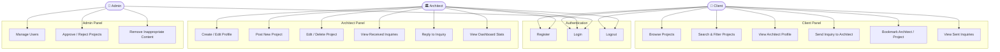

# Use Case Diagram

```mermaid
flowchart TD
    Client(["👤 Client"])
    Architect(["🏛️ Architect"])
    Admin(["🔧 Admin"])

    subgraph Authentication
        UC1[Register]
        UC2[Login]
        UC3[Logout]
    end

    subgraph Client Panel
        UC4[Browse Projects]
        UC5[Search & Filter Projects]
        UC6[View Architect Profile]
        UC7[Send Inquiry to Architect]
        UC8[Bookmark Architect / Project]
        UC9[View Sent Inquiries]
    end

    subgraph Architect Panel
        UC10[Create / Edit Profile]
        UC11[Post New Project]
        UC12[Edit / Delete Project]
        UC13[View Received Inquiries]
        UC14[Reply to Inquiry]
        UC15[View Dashboard Stats]
    end

    subgraph Admin Panel
        UC16[Manage Users]
        UC17[Approve / Reject Projects]
        UC18[Remove Inappropriate Content]
    end

    Client --> UC1
    Client --> UC2
    Client --> UC3
    Client --> UC4
    Client --> UC5
    Client --> UC6
    Client --> UC7
    Client --> UC8
    Client --> UC9

    Architect --> UC1
    Architect --> UC2
    Architect --> UC3
    Architect --> UC10
    Architect --> UC11
    Architect --> UC12
    Architect --> UC13
    Architect --> UC14
    Architect --> UC15

    Admin --> UC2
    Admin --> UC16
    Admin --> UC17
    Admin --> UC18
```
