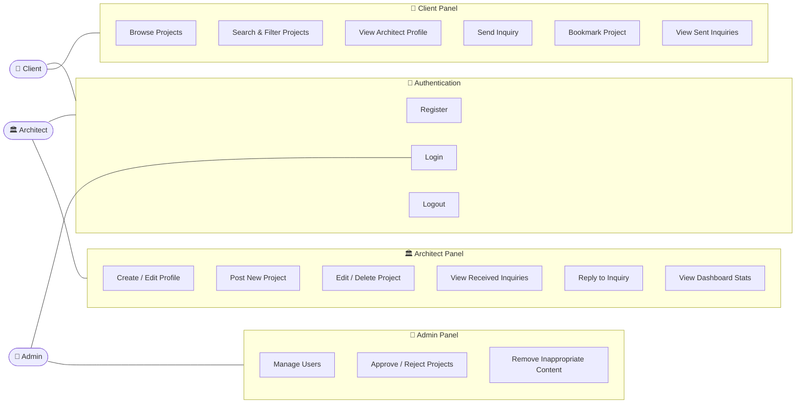

# Use Case Diagram

```mermaid
flowchart LR
    Client(["👤 Client"])
    Architect(["🏛️ Architect"])
    Admin(["🔧 Admin"])

    subgraph AUTH["🔐 Authentication"]
        direction TB
        UC1["Register"]
        UC2["Login"]
        UC3["Logout"]
    end

    subgraph CP["📱 Client Panel"]
        direction TB
        UC4["Browse Projects"]
        UC5["Search & Filter Projects"]
        UC6["View Architect Profile"]
        UC7["Send Inquiry"]
        UC8["Bookmark Project"]
        UC9["View Sent Inquiries"]
    end

    subgraph AP["🏛️ Architect Panel"]
        direction TB
        UC10["Create / Edit Profile"]
        UC11["Post New Project"]
        UC12["Edit / Delete Project"]
        UC13["View Received Inquiries"]
        UC14["Reply to Inquiry"]
        UC15["View Dashboard Stats"]
    end

    subgraph ADMIN["🔧 Admin Panel"]
        direction TB
        UC16["Manage Users"]
        UC17["Approve / Reject Projects"]
        UC18["Remove Inappropriate Content"]
    end

    Client --- AUTH
    Client --- CP

    Architect --- AUTH
    Architect --- AP

    Admin --- UC2
    Admin --- ADMIN
```
